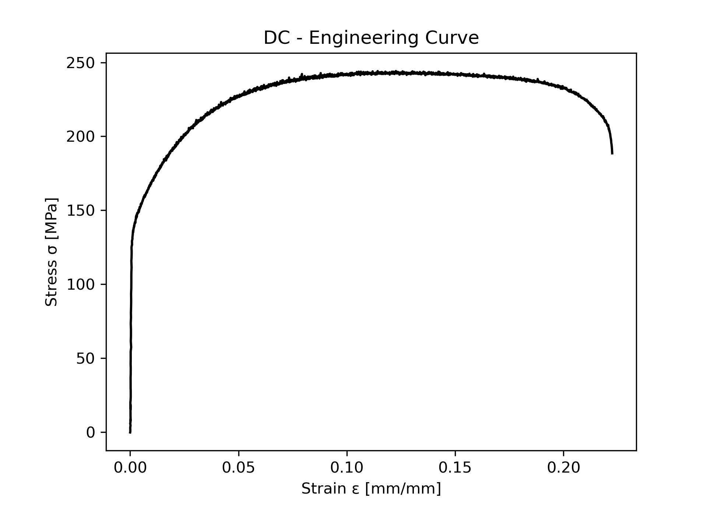
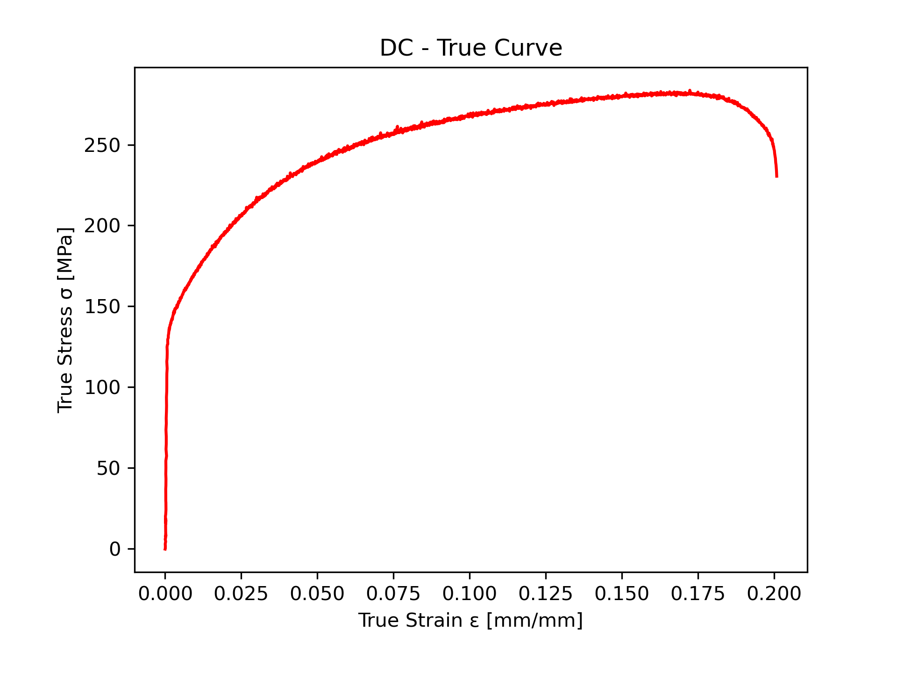

# stress_strain 

Generate engineering and true stress - strain curve.

## Description

This python code calculates engineering and true stress - strain curve using with raw test data then generates test report and plots the curves.

## Usage

You need to put test data raw file into the same directory with named "test_data.txt".
 - If you have more tests in the test_data.txt select the test number.
 - Select section geometry. (Rectangular or Circular). Or you can enter directly initial section area. 
 - Enter informations about section area. (Thickness, width or diameter)
 - Enter Gauge Length size in mm.

All units must be given with Newton and milimeter.

## Which files will export?

 - Test Report File ("test_report.html")
 - Engineering Stress - Strain Curve image
 - True Stress - Strain Curve image
 - Test Data Excel File ("test_data.xls)

## Screenshot

